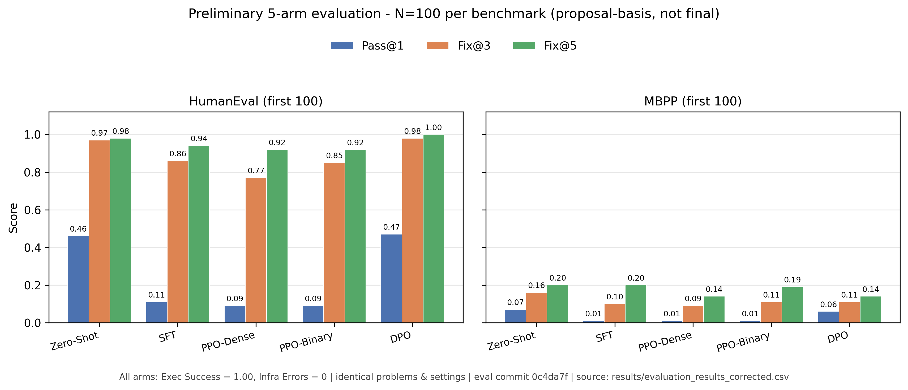

# Experiment Validation Status

## Current status

The September 2026 notebook runs are preserved as execution evidence, but the numerical results from the original Notebook 7 must not be treated as final paper results until they are reproduced with the corrected execution pipeline.

### Corrected requirements

1. Every scored example must have explicit executable benchmark tests.
2. Empty test suites must never receive an AC score.
3. MBPP `test_list`, HumanEval `test`, and APPS `input_output` must be recognized.
4. PPO must load the trained SFT adapter; it must not silently fall back to the base model.
5. PPO reward must be computed from benchmark execution, not merely process exit status.
6. The evaluation must not silently replace a missing SFT/PPO/DPO checkpoint with the base model.
7. Smoke-test results (N<=20 per benchmark) are validation evidence only, not final paper results.
8. Final comparisons must use the same fixed evaluation set, decoding settings, and evaluation code for all available variants.
9. Packed APPS multi-test stdin suites must be scored with segment/line partial credit (`packed_tests=T`), not binary 0/1.
10. PPO must use a frozen SFT `ref_model` (`is_peft_model=False`, `kl_penalty=abs`, `horizon=100`) so KL is measured against the SFT policy, not the base model.
11. Paper PPO runs must set `reward_mode` (`dense` for RQ3, `binary` for RQ4), fixed `seed`, and write to separate dirs `./checkpoints/ppo_dense` / `./checkpoints/ppo_binary` with `ppo_metadata.json` recording mode, seed, and commit SHA.
12. DPO preference collection must use the same `normalize_tests` harness as PPO/eval (not the old monolithic `parse_apps_test_cases` path). Paper DPO uses `train[:500]+` with seed 42.
13. Final evaluation must cover five arms: Zero-Shot, SFT, PPO-dense, PPO-binary, DPO on full HumanEval (164) + MBPP (500) with identical seed/decoding/tests.

## Corrected notebooks

- `notebooks/05_ppo_training_corrected.ipynb`: PPO with `REWARD_MODE` dense/binary, separate checkpoint dirs, seed 42, `MAX_STEPS=100` paper default (10 = smoke).
- `notebooks/06_dpo_training.ipynb`: fresh `junior-A` clone, `normalize_tests` harness, `train[:500]` preference split, seed logged.
- `notebooks/07_evaluation_and_ablations_corrected.ipynb`: five-arm eval (Zero-Shot / SFT / PPO-dense / PPO-binary / DPO), full-set by default, fixed seed.

## PPO validation

- **Smoke Test Status**: **PASSED (2026-09-18)** — pipeline only; metrics from that run are superseded.
- **Verified Training Status**: **PASSED (2026-09-24)** on `junior-A` @ `56ce85a` / `d3cada9`
  - SFT adapter (`./checkpoints/sft/final`) loaded into `AutoModelForCausalLMWithValueHead` with frozen `ref_model`.
  - Supervisor issues **all fixed and verified against real Kaggle logs**:
    1. **Partial/positive rewards**: packed multi-test suites yield `passed=2/8`, `1/4`, `1/3` with `reward=0.25–0.33`; full AC samples at `1.0`.
    2. **KL sign/magnitude**: step 1 `kl=0.000`, steps 2–10 `kl` in `[1.10, 2.17]`, all positive; adaptive `kl_coef` decays `0.0500→0.0482` (correct when KL < target).
    3. **`grad_norm` logging**: non-zero every step (`0.16–0.32`); `param_norm_delta` and `sample_lora_delta` positive throughout.
  - Full step-by-step metrics: see `outputs.md` → “Notebook 05: Reinforcement Learning: PPO Training” (2026-09-24 verified section).
  - Test suite: **56 tests pass** locally (`python -m unittest discover -s tests`).
  - Note: that diagnostic used the legacy `./checkpoints/ppo` dir. Paper arms write to `ppo_dense` / `ppo_binary` with `reward_mode` + seed in metadata.

## Paper-run readiness (2026-09-24)

| Component | Ready? | Notes |
|---|---|---|
| Dense reward + packed partial credit | Yes | `score_rollout_reward(..., "dense")` |
| Binary AC-only reward | Yes | `score_rollout_reward(..., "binary")` |
| Dual checkpoints + metadata | Yes | `ppo_dense` / `ppo_binary`, seed + commit in JSON |
| DPO harness = PPO harness | Yes | `parse_apps_test_cases` → `normalize_tests` |
| NB05 / NB06 / NB07 wiring | Yes | Flip `REWARD_MODE`, full eval arms |
| Paper training runs | **Complete** | Dense ✅ + binary ✅ (2026-09-25, 100 steps each, `36c8055`, metadata verified); DPO checkpoint ✅ (lead-approved NB06 run; base-init + 100 pairs caveat recorded in `outputs.md` NB07) |
| 5-arm eval | **Partial** | Smoke N=20 ✅ + large N=100 ✅ (2026-09-28, `0c4da7f`, all 5 arms, Exec 100%, infra 0) — N=100 accepted as proposal-basis preliminary eval; FULL set (164+500) planned for final paper |

## Preliminary 5-arm evaluation — N=100, proposal-basis (2026-09-28)

> **PRELIMINARY / PROPOSAL-BASIS — NOT final paper results.** First 100 problems of HumanEval (of 164) and MBPP (of 500), identical subset and identical generation settings for all five arms. Full-set evaluation (164+500) is reserved for the final paper (rule 13).

| Model | HE Pass@1 | HE Fix@3 | HE Fix@5 | MBPP Pass@1 | MBPP Fix@3 | MBPP Fix@5 | Exec Success | Infra Errors |
|---|---|---|---|---|---|---|---|---|
| Zero-Shot | 0.46 | 0.97 | 0.98 | 0.07 | 0.16 | 0.20 | 1.00 | 0 |
| SFT | 0.11 | 0.86 | 0.94 | 0.01 | 0.10 | 0.20 | 1.00 | 0 |
| PPO-Dense | 0.09 | 0.77 | 0.92 | 0.01 | 0.09 | 0.14 | 1.00 | 0 |
| PPO-Binary | 0.09 | 0.85 | 0.92 | 0.01 | 0.11 | 0.19 | 1.00 | 0 |
| DPO | 0.47 | 0.98 | 1.00 | 0.06 | 0.11 | 0.14 | 1.00 | 0 |

**DPO caveat (RQ5)**: the current DPO checkpoint was **initialized from the base model** (the SFT-adapter search fell back) and trained on only **100 pairs**. Its numbers essentially track the base-model starting point (cf. Zero-Shot), so current DPO-vs-PPO numbers **cannot** be used as a clean RQ5 conclusion.

**Verified / reproducible**:
- **Fairness**: single shared dataset load → identical first-100 subsets for all arms; one generation path (`build_prompt`; turn-0 greedy; turns 1-4 temp 1.0 / top-p 0.95; 512 tokens; K=5; seed 42 reset per arm×benchmark); tests via `normalize_tests`.
- **PPO provenance (Step A cell)**: dense vs binary metadata differ only in `reward_mode`/`reward_type`; `seed=42`, `commit=36c8055`, `max_steps=100`, HPs identical, trainable `3,147,777`.
- **Checkpoint gate (NB07 runner)**: `PAPER_PPO_SPEC = {seed: 42, max_steps: 100, target_kl: 4}` + `commit_sha` prefix `36c8055` enforced — non-paper checkpoints raise **before** any evaluation; resolved `checkpoint_paths` recorded in the run JSON.
- **Artifacts**: `results/evaluation_results_corrected.csv` + `.json` (with `artifact_provenance`); figure `results/preliminary_eval_n100.png/.pdf` generated from the CSV by `results/make_preliminary_figure.py`.
- **Tests**: `python -m unittest discover -s tests` → 60 pass.

## Reporting rule

Do not report the previous Notebook 7 percentages as empirical conclusions. Replace them only with results from the corrected, reproducible evaluation runs.

Do not cite the pre-fix PPO smoke/50-step logs (negative KL, `grad_norm=0`, binary-only rewards) as current results — they are retained in `outputs.md` only as historical superseded evidence.
